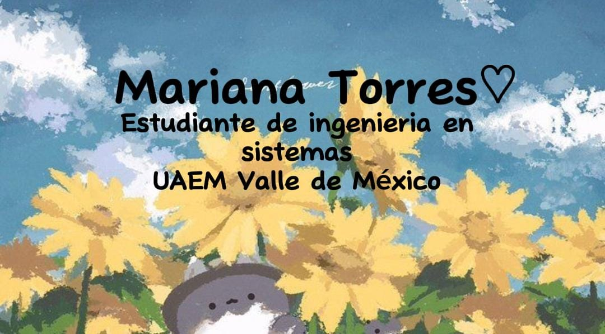

 
### 💙 💙 💙 💙 💙 💙 💙 💙 💙 💙 💙 💙 💙 💙 💙 💙 💙 💙 💙 💙 💙 💙 💙 💙 💙 💙 💙  
<h4>Creditos a mi hermanita "Luz Guadalupe" por la creación de la portada 🤗💜</h4> 
 

	
	 

<h4>Hi there👋</h4> 
<ul>

<li><b>👤 Name:  </b> Mariana Torres </li>
<li><b>📍 Location:  </b> Mexico City </li>
<li><b>📣 Languages: </b>  English B1 & Spanish </li>
<li><b>👨‍🎓 Actual studies: </b> Licenciatura en Ingenieniería en Sistemas y Telecominucaciónes </li>
</ul>

<!--
**MarianaTom/MarianaTom** is a ✨ _special_ ✨ repository because its `README.md` (this file) appears on your GitHub profile.

Here are some ideas to get you started:

- 🔭 I’m currently working on ...
- 🌱 I’m currently learning ...
- 👯 I’m looking to collaborate on ...
- 🤔 I’m looking for help with ...
- 💬 Ask me about ...
- 📫 How to reach me: ...
- 😄 Pronouns: ...
- ⚡ Fun fact: ...
-->
